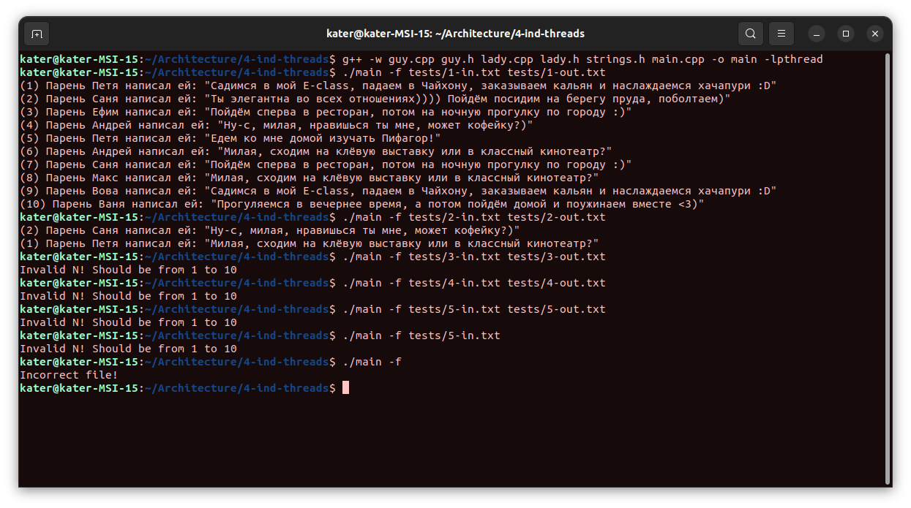
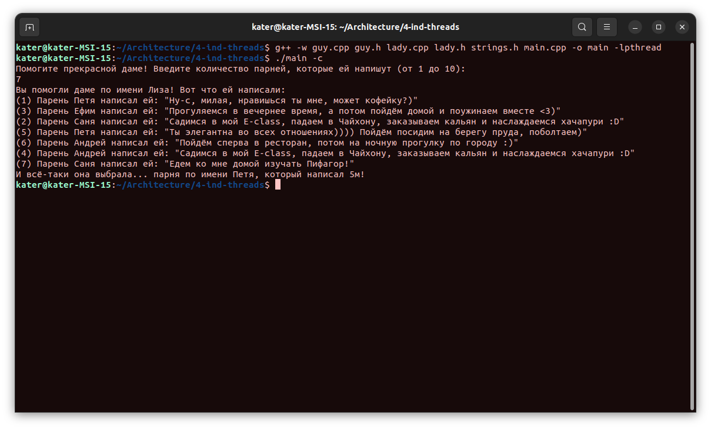
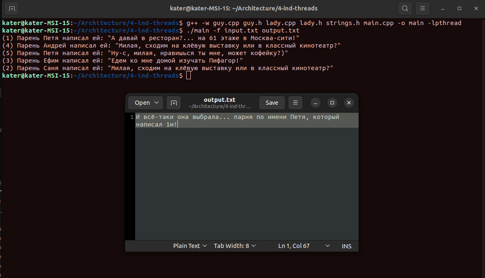
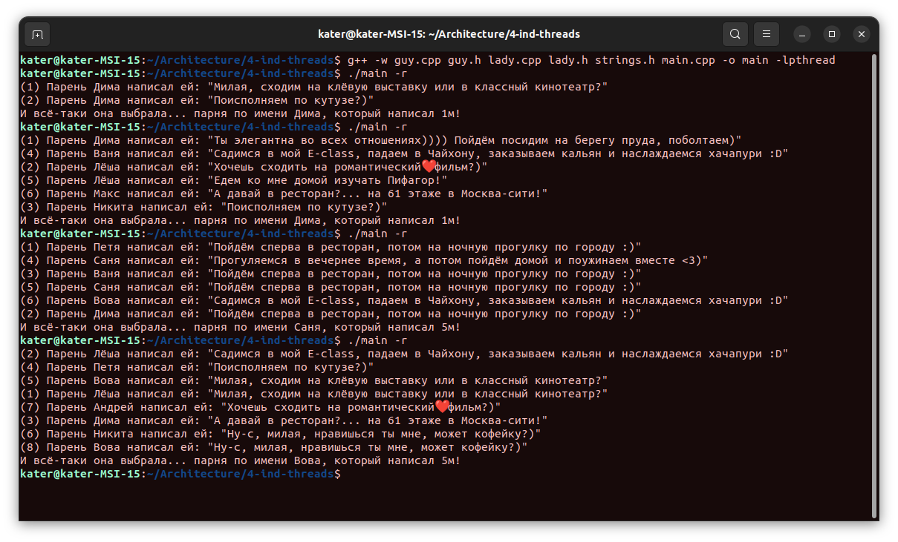

# Архитектура вычислительных систем. ИДЗ №4.

### Вариант 24. У одной очень привлекательной студентки есть N поклонников. Традиционно в день св. Валентина очень привлекательная студентка проводит романтический вечер с одним из поклонников. Счастливый избранник заранее не известен. С утра очень привлекательная студентка получает N «валентинок» с различными вариантами романтического вечера. Выбрав наиболее заманчивое предложение, студентка извещает счастливчика о своем согласии, а остальных – об отказе. Требуется создать многопоточное приложение, моделирующее поведение студентки. При решении использовать парадигму «клиент-сервер» с активным ожиданием.

#### Выполнил Старцев Евгений, БПИ219.

---

### Планируемая оценка - 8 баллов.

### Выбранная парадигма

Клиенты и серверы. Её использование регламентировано условием задачи.

### Как запустить программу?

Для запуска программы необходимо ввести следующую команду:

```
g++ -w guy.cpp guy.h lady.cpp lady.h strings.h main.cpp -o main -lpthread
```

Следующую команду необходимо ввести в зависимости от желаемого типа ввода.

Для ввода в консоли:

```
./main -c 
```

Для ввода через файл (`input.txt` - файл с вводными данными, `output.txt` - файл, куда будут записаны выходные данные.
Названия могут меняться):

```
./main -f input.txt output.txt 
```

Для рандомного ввода:

```
./main -r 
```

### Ввод и вывод данных.

Как было отмечено в предыдущем пункте, в программе предусмотрены ввод через консоль, файл, а также рандомный ввод
(программа сама решает, сколько поклонников будет у прекрасной дамы).

Вывод предусмотрен в консоли и в файл.

### Требования на 4 балла - `выполнены`

### Требования на 5 баллов - `выполнены`

#### Сценарий, описывающий одновременное поведение представленных в условии задания сущностей в терминах предметной области.

В программе присутствуют основные две сущности - Lady (дама, она же привлекательная студентка) и Guy (парень, он же
потенциальный кандидат).

Для начала пользователем вводится число - количество парней, которые написали привлекательной
студентке. Исходя из этого числа, создаётся объект сущности Lady, в котором указывается количество поклонников. Далее
создаётся введённое количество поклонников, им присваиваются имена и сообщения, которые они будут отправлять
привлекательной студентке. Для каждого запускается отдельный поток, в котором и выводится сообщение прекрасной даме.
Далее привлекательная студентка выбирает довольно случайным образом того самого парня, с которым она проведёт прекрасный
романтический вечер 14 февраля.

### Требования на 6 баллов - `выполнены`

#### Обобщённый алгоритм, используемый при реализации программы исходного словесного сценария.

Алгоритм следующий:

1. Пользователем вводится число N от 1 до 10 включительно. Это количество парней, которые будут делать предложение
   привлекательной студентке.
2. Создаётся объект сущности Lady, в котором создаётся N объектов сущности Guy. Для каждого запускается поток, в котором
   выбирается сообщение. Сообщение же "будет отправлено" привлекательной студентке. А студентка же выбирает того самого
   поклонника, который будет с ней вечером 14 февраля. В целях безопасности при выборе сообщения используются мьютексы
   (mutex).
3. Происходит задержка 1 секунда, после чего в необходимое место (терминал/файл) выводится информация о выборе
   студентки.

### Требования на 7 баллов - `выполнены`

### Требования на 8 баллов - `выполнены`

Входные и выходные данные с различными результатами выполнения программы находятся в папке [tests](tests).

Скриншот, демонстрирующий, что все тесты были запущены:


Также ниже представлены скриншоты, демонстрирующие работоспособность программы при всех трех режимах ввода:

Ввод с консоли:


Ввод с файла:


Рандомный ввод:


В файлах присутствуют все необходимые комментарии.

Все необходимые формы ввода реализованы (смотрите первую часть отчёта, раздел `Ввод и вывод данных`).

### Немного о выполнении задачи

Дабы понять, какие романтические вечера наиболее привлекают элегантных дам студенческого возраста, были заданы вопросы
непосредственно представителям прекрасного пола. Часть вариантов проведения 14 февраля, предлагаемых парнями в
приведённой программе, были предложены непосредственно привлекательными студентками различных университетов. Ну и,
разумеется, не обошлось без вдохновения семинарами по АВС :)

### О парадигме "Клиенты и серверы"

Клиенты и серверы - довольно популярная парадигма. Она делит работу приложение "на две части" - первая часть - это
непосредственно сервер, который получает запросы от клиента и обрабатывает их. Клиент же (вторая часть)отправляет
запросы на сервер и получает от сервера ответ в виде определённого набора данных.

В данной программе можно представить парней клиентами, а привлекательную студентку - сервером. Звучит странно, но это
так и есть.